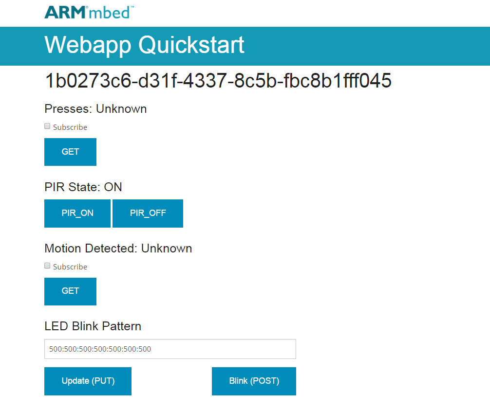

# mbed-server-withPIR

This is a simple webapp for mbed server meant to be paired with the [mbed-client-withPIR](https://github.com/MaggieMei/mbed-client-withPIR) application. The goal of this application is to get the user up and running, using the mbed-connector-python package and talking to devices through mbed Device Connector in under 5 min, 5 steps or less. 

If you are not familiar with the mbed connector api, we recommend that you read the [mbed-connector-api-python](https://github.com/armmbed/mbed-connector-api-python) first.

### Pre-requisites
- A [mbed connector](https://connector.mbed.com) account and have generated an [API token](https://connector.mbed.com/#accesskeys)
- An endpoint with PIR sensor running the [mbed-client-withPIR](https://github.com/MaggieMei/mbed-client-withPIR)
- Install the required packages `pip install -r requirements.txt`

### Use
1. Put your [API key](https://connector.mbed.com/#accesskeys) into the app.py file, replace the following text
    ```python
    token = "Change Me" # replace with your API token
    ```
    or set an evironment variable called `ACCESS_KEY` with the value of your API key
2. Run the `app.py` file
```python
python ./app.py
```
3. Open a web page to the web.py server. Usually [//localhost:8080](//localhost:8080) will work. 

    

4. Interact with the web page, blink the LED's, control the sensor, subscribe to the resources, click the button on the board, keep the PIR sensor working and see the numbers tick up on the web app.
5. Modify : go checkout the API for the [mbed-connector-api-python library](https://docs.mbed.com/docs/mbed-connector-api-python/en/latest/) and make your own applications!


## Troubleshooting
Here are some common problems and their solutions.

##### Cannot establish a secure connection
This is most likely caused by not having the `requests[security]` package installed. If you are using Ubuntu 14.4 LTS you may need to update pip first `pip install -U pip` and then install the requests security package `pip install -U requests[security]`. 

##### WebSocket transport not available
Dont worry about that warning message, it is not applicable to this demo, but likewise the warning message cannot be disabled. 

##### ERROR 500 on trying to run the app.py file
Make sure you added your [Access Key](https://connector.mbed.com/#accesskeys) to the app. You can do this by either changing the value of the `token` variable in the app.py file or by setting the `ACCESS_KEY` environment variable to your access key. 

